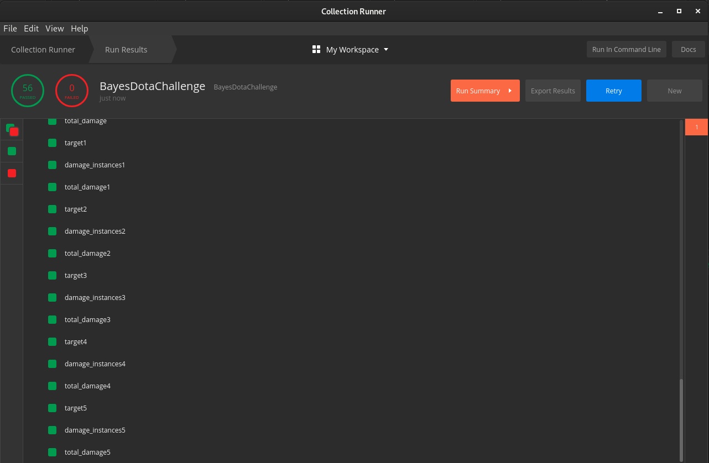

bayes-dota
==========

This is the [task](TASK.md).

Any additional information about your solution goes here.

As I said in email 2 hours is too short for this task as I see it. Since I didn't got any response I made faster solution as mentioned in email.

I hope you used [Postman](https://www.postman.com/). It's great tool for testing and developing API.
You have postman tests in folder postman. You need to import test collection and BayesDotaChallenge environment into postman.

[More information about importing collection and environment.](https://learning.postman.com/docs/postman/collections/importing-and-exporting-data/)

After that you can start Runner, select collection, environment and click "Start Run". It will start running tests. 
You can see how it looks on picture below.

 